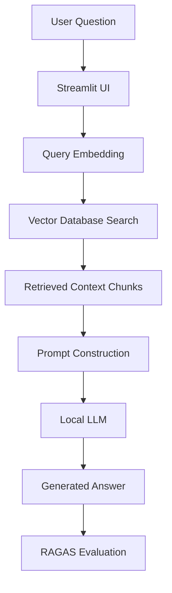

# 🧠 Enterprise Retrieval-Augmented Generation (RAG) System

A local document question-answering system that allows users to upload private documents and ask natural language questions. The system retrieves relevant context from documents and uses a local LLM to generate grounded, context-aware answers.

---

## 🎯 What this project does

This system enables semantic search and question answering over private documents without relying on external APIs. It is designed as an end-to-end RAG pipeline with evaluation to ensure response quality and factual grounding.

---

## 🌟 Highlights
- 🧠 End-to-end Retrieval-Augmented Generation (RAG) pipeline
- 🔎 Semantic search using dense embeddings (not keyword-based search)
- 📄 PDF ingestion with structured text chunking for unstructured documents
- 💬 Context-grounded LLM responses to reduce hallucinations
- 📊 Evaluation-driven development using Ragas (faithfulness, relevance, precision)
- ⚙️ Fully modular architecture (easy to extend, test, and debug)
- 🔐 Local-first inference using Ollama for data privacy

---

## ℹ️ Overview

This project builds a RAG system that lets you ask questions about private document collections and get answers based on the actual content inside them.

It combines semantic search with a local LLM so that responses are generated using relevant retrieved context instead of general model knowledge.

The system is designed for practical use cases like internal document search, knowledge assistants, and exploring unstructured data in a structured way.

The goal is to show end-to-end skills in building LLM applications, including embeddings, retrieval pipelines, vector databases, and evaluation-driven development.

---

## ✍️ Authors

Chelsea Khor  
GitHub: https://github.com/celseakr

---

## 🚀 Setup & Execution
1. Clone repository 
```bash
git clone https://github.com/your-username/rag-platform.git
cd rag-platform
```
2. Install dependencies
```bash
pip install -r requirements.txt
```
3. Start local LLM runtime
 ```bash 
ollama run llama3
```
4. Launch application
 ```bash
streamlit run app.py
```

Example interaction:
```python
>>> Ask: "What does the document say about refund policy?"
>>> Answer: "Refunds are eligible within 30 days under conditions specified in section 4.2..."
```
Upload a PDF, then query it using natural language.

---

## Requirements:
- Python 3.10+
- Ollama installed locally
- Recommended: 8GB+ RAM for local LLM inference

---

## 🏗️ Architecture Diagram


  
---

## 🧰 Technology Stack

- **LLM Runtime:** Ollama (LLaMA 3)
- **Embeddings:** Open-source sentence transformer models
- **Vector Database:** ChromaDB (local), Pinecone-compatible abstraction
- **Orchestration:** LangChain
- **Document Processing:** PyPDF
- **Evaluation:** Ragas (faithfulness, answer relevance, context precision)
- **Frontend:** Streamlit
- **Language:** Python

---

## ⚙️ Core Capabilities

### 📄 Document Processing
- Handles multi-page, unstructured PDF files
- Extracts and cleans raw text
- Splits documents into semantically meaningful chunks

### 🔎 Semantic Retrieval
- Converts queries into dense vector embeddings
- Performs nearest-neighbour similarity search
- Retrieves contextually relevant document sections

### 🧠 Retrieval-Augmented Generation
- Injects retrieved context into prompts
- Grounds responses strictly in retrieved documents
- Reduces hallucinations through constrained generation

### 📊 Evaluation Layer
- Uses Ragas to evaluate response quality
- Measures:
  - Faithfulness to source context
  - Answer relevance to query
  - Context precision and retrieval quality
- Enables iterative improvement based on metrics

---

## 🖥️ Interface

A lightweight Streamlit interface provides:

- Upload and ingestion of PDF documents
- Interactive question-answering over documents
- Real-time generation of grounded responses

---

## 📁 Repository Structure
```text
rag-platform/
│
├── app.py                 # Streamlit application layer
├── ingest.py              # Document ingestion pipeline
├── chunking.py            # Text segmentation logic
├── embeddings.py          # Embedding generation layer
├── vectorstore.py         # Vector DB abstraction layer
├── retriever.py           # Semantic retrieval engine
├── rag_chain.py           # RAG orchestration pipeline
├── evaluation.py          # Ragas-based evaluation suite
│
├── data/                 # Raw document inputs
├── vectorstore/          # Persistent vector index
└── README.md
```

---

## 🎯 Engineering Objectives

This system demonstrates competency in:

- Retrieval-augmented generation system design
- Vector search and embedding-based retrieval
- LLM orchestration and prompt conditioning
- Modular pipeline architecture
- Evaluation-driven development for LLM applications
- Local-first AI deployment strategies

---

## 📌 Design Principles
- Grounded generation over open-ended inference
- Modular separation of retrieval and generation layers
- Deterministic preprocessing for reproducibility
- Evaluation-first iteration loop
- Local-first architecture for data privacy control

---
## 🧠 Summary

This project implements a modular RAG system for document intelligence, combining semantic retrieval with local LLM generation. It focuses on producing grounded, verifiable answers and uses evaluation metrics to continuously improve retrieval and response quality.
